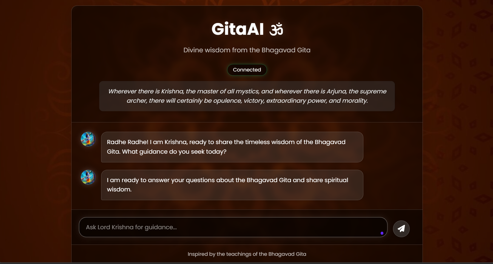

# GitaAI - Lord Krishna's Wisdom Chatbot

A simple web-based chatbot that lets you seek wisdom from Lord Krishna based on the teachings of the Bhagavad Gita, powered by Google's Gemini AI.

## Screenshot



## Features

- Chat-like interface for asking questions to Lord Krishna
- Responses based on the teachings of the Bhagavad Gita
- Responsive design that works on desktop and mobile
- Beautiful transparent interface with backdrop blur effects
- Rotating spiritual quotes from the Bhagavad Gita
- Fallback responses in case of API issues

## Requirements

- Python 3.7 or higher
- Flask
- Flask-CORS
- Google Generative AI Python SDK

## Installation

1. Clone this repository or download the code.

2. Install the required Python packages:

```bash
pip install -r requirements.txt
```

3. The Gemini API key is already included in the code. If you want to use your own key, modify the `GEMINI_API_KEY` value in `gitaai.py`.

## Usage

1. Start the Flask server:

```bash
python gitaai.py
```

2. Open your web browser and go to:

```
http://localhost:5000
```

3. Start asking questions to Lord Krishna!

## Deployment

You can deploy this application on several platforms:

### Render (Free & Easy)
1. Create an account on [Render](https://render.com/)
2. Create a new Web Service and connect your GitHub repository
3. Set the build command: `pip install -r requirements.txt`
4. Set the start command: `python gitaai.py`
5. Add your Gemini API key as an environment variable

### Heroku
1. Create a Procfile with: `web: python gitaai.py`
2. Update code to use environment port: `port = int(os.environ.get("PORT", 5000))`
3. Deploy using Heroku CLI or GitHub integration

### Railway or PythonAnywhere
These platforms also offer simple deployment options for Python applications.

## How It Works

- The frontend is built with HTML, CSS, and JavaScript.
- The backend uses Flask to serve the API endpoints.
- Questions are sent to Google's Gemini AI model, which is prompted to respond as Lord Krishna.
- Fallback responses are provided if the API encounters any issues.

## Examples of Questions to Ask

- What is the purpose of life according to the Bhagavad Gita?
- How can I achieve inner peace?
- What is karma yoga?
- How do I overcome attachment?
- What is the nature of the soul?
- How should I handle difficult choices? 
